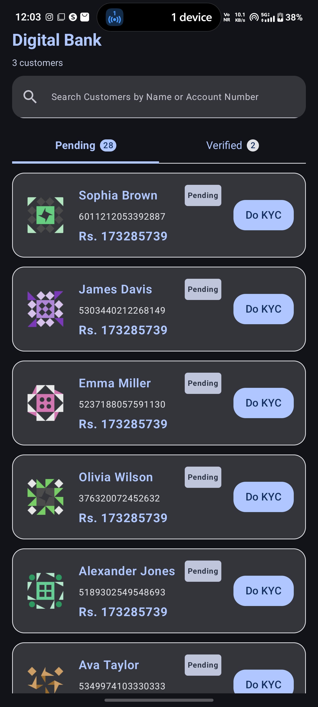
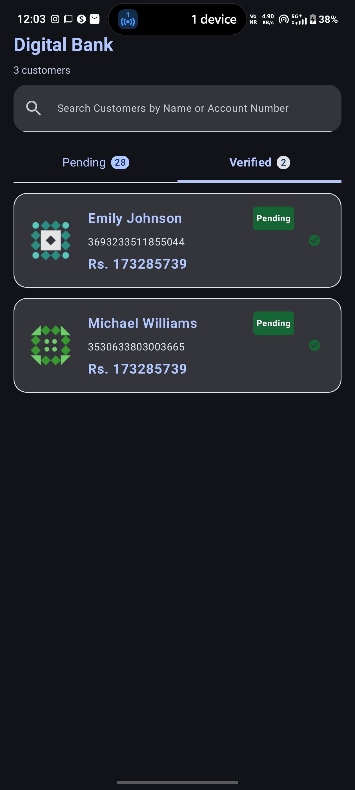
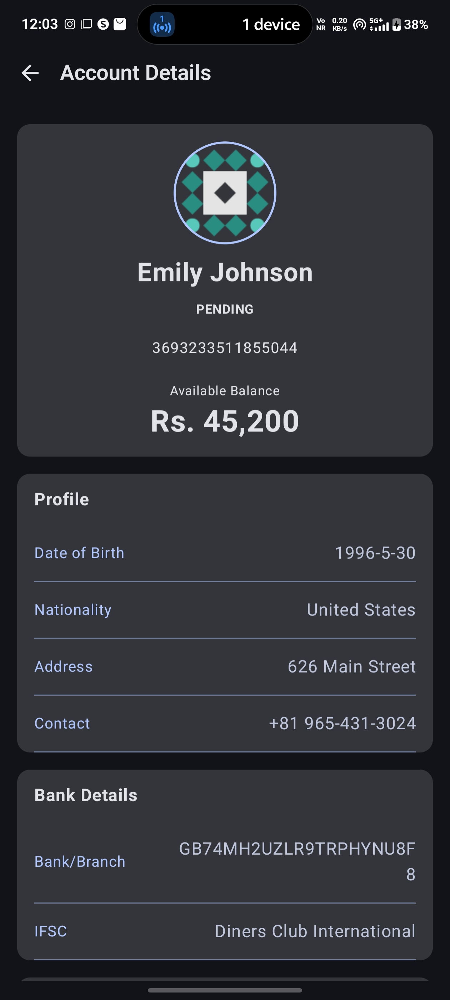
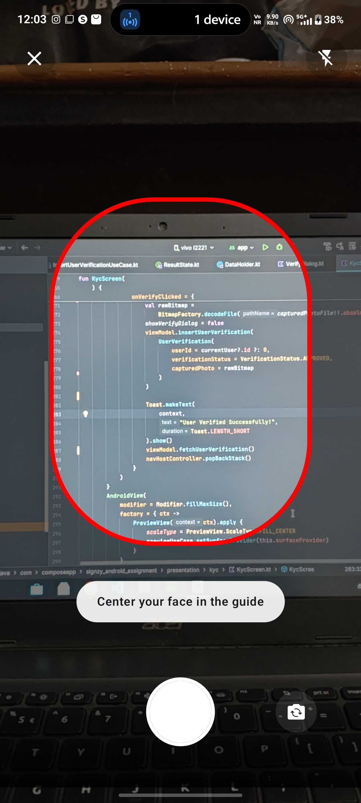

# Signzy Android Assignment


A modern Android Banking application built in **Kotlin** following **MVVM + Clean Architecture** principles. The application enables Relationship Managers to browse customer accounts, verify customer KYC using an in-app camera, and fetch live bank branch details from IFSC codes.

---

## 📱 Features

### 🔍 Accounts Screen
- View customers in two tabs:
    - ✅ Verified KYC
    - ⏳ Pending KYC
- Search customers by:
    - Name
    - Account Number (Masked IBAN)
- Customer cards display:
    - Avatar
    - Customer Name
    - Masked Account Number
    - Account Balance
    - KYC Status

---

### 👤 Account Details Screen

Displays complete customer information including:

- Profile Photo
- Name
- Date of Birth
- Nationality
- Address
- Contact Information
- Masked Account Number
- Account Balance
- Live Bank & Branch Details

---

### 📷 KYC Verification

Customers with Pending KYC can complete verification by:

- Opening an **in-app CameraX camera**
- Capturing a selfie
- Automatically changing status to **Verified**
- Updating the customer photo
- Moving the customer to the Verified tab

The captured selfie and KYC status are persisted locally and survive app restarts.

---

## 🚀 Tech Stack

- Kotlin
- Jetpack Compose
- MVVM Architecture
- Clean Architecture
- Hilt (Dependency Injection)
- Navigation Compose
- Kotlin Coroutines
- Flow / StateFlow
- Retrofit
- OkHttp
- Room Database
- DataStore
- Coil
- CameraX

---

## 🏗️ Architecture

```
Presentation
│
├── UI (Jetpack Compose)
├── ViewModels
│
Domain
│
├── UseCases
├── Repository Interfaces
│
Data
│
├── Remote API
├── Local Database
├── Repository Implementation
├── Models
```

The project follows **Single Source of Truth**, Repository Pattern, and Unidirectional Data Flow.

---

## 🌐 APIs Used

### DummyJSON

Used to fetch customer profile information.

```
https://dummyjson.com/users
```

Provides:

- User Profile
- Avatar
- Email
- Phone
- Address
- Bank Information

---


## 💾 Local Persistence

The app stores:

- Customer KYC Status
- Captured Selfie
- Cached API Responses

This allows the app to work smoothly after restarting.

---

## 📦 Project Structure

```
app
│
├── data
│   ├── database
│   ├── remote
│   |__ repository
│
├── domain
│   ├── repository
│   ├── usecase
│   └── model
│
├── presentation
│   ├── profile
│   ├── home
│   ├── kyc
│   ├── comman
│   └── navigation
│
├── di
│
└── utils
```

---

## ⚡ App Flow

```
Launch App
      │
      ▼
Fetch Customers
      │
      ▼
Accounts Screen
      │
      ▼
Select Customer
      │
      ▼
Account Details
      │
      ├───────────────┐
      │               │
Verified          Pending
      │               │
      │        Open CameraX
      │               │
      │        Capture Selfie
      │               │
      └────► Save Image
                    │
                    ▼
            Mark as Verified
                    │
                    ▼
          Move to Verified Tab
```

---

## ✨ Highlights

- Clean Architecture
- CameraX Integration
- Runtime Permission Handling
- StateFlow Based UI
- Repository Pattern
- Responsive Jetpack Compose UI
- Error, Loading and Empty States
- Search Functionality
- Persistent KYC Status

---

## 📸 Screenshots

| Accounts | Verified                    | Details                    | Kyc                          |
|-----------|-----------------------------|----------------------------|------------------------------|
|  |  |  |  |
---

## 🎥 Demo

```
https://github.com/Sk2105/SignzyAndroidAssignment/images/
```

---

## 🛠️ Getting Started

### Clone Repository

```bash
git clone https://github.com/Sk2105/SignzyAndroidAssignment.git
```

### Open Project

Open the project in **Android Studio**.

### Build

Sync Gradle and Run the app.

Minimum SDK:

```
Android 8.0 (API 26)
```

---

## 📌 Future Improvements

- Pagination
- Dynamic Light/Dark Theme
- Pull-to-Refresh
- Better Offline Synchronization
- Unit Tests
- UI Tests
- Biometric Authentication
- Account Type Filters
- Better Animations

---

## 📄 License

This project was developed as part of an Android Developer Assignment and is intended for learning and evaluation purposes.

---

## 👨‍💻 Developer

**Sachin Kumar**

Android Developer

GitHub: https://github.com/sk2105

LinkedIn: https://www.linkedin.com/in/sachink91/